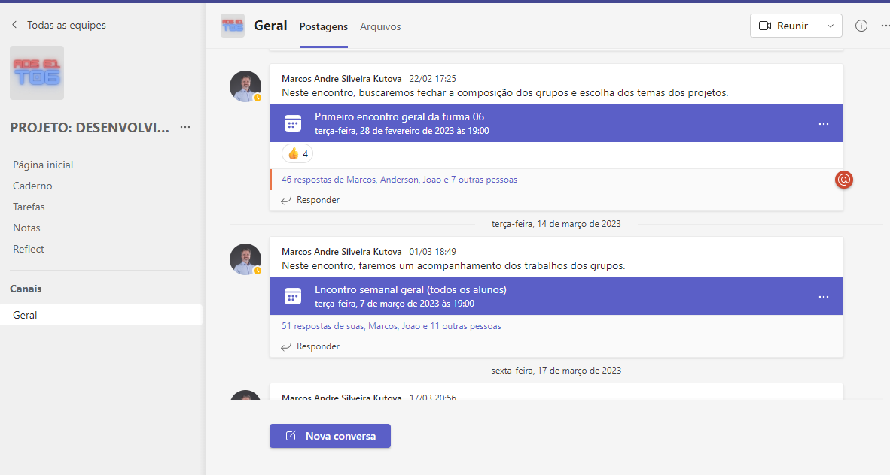

# Metodologia

Apresentamos a seguir a metodologia adotada pelo grupo para desenvolvedor o sistema de controle financeiro. Destacamos também as ferramentas e ambientes de trabalho utilizados pela equipe para o desenvolvimento do projeto. Isso inclui a descrição dos diferentes ambientes utilizados, bem como a estrutura para gerenciamento do código-fonte. Além disso, abordamos o processo e as ferramentas utilizadas para organizar e gerenciar o time.

 

## Relação de Ambientes de Trabalho

Os artefatos do projeto são desenvolvidos a partir de diversas plataformas e a relação dos ambientes com seu respectivo propósito é apresentada na tabela que se segue:

|Ambiente    | Plataforma  | Link de Acesso |
|-----------|---------------------|-------------------|
|Repositório de código fonte| GitHub |https://github.com/ICEI-PUC-Minas-PMV-ADS/pmv-ads-2023-1-e1-proj-web-t06-portal-financeiro  | 
|Documentos do Projeto| GitHub | https://github.com/ICEI-PUC-Minas-PMV-ADS/pmv-ads-2023-1-e1-proj-web-t06-portal-financeiro/tree/main/docs |
|Projeto de Interface e Wireframes| Figma | https://www.figma.com/team_invite/redeem/m2iPoeeV0mD8wRWqAdBlXy |
|Gerenciamento de Projeto| GitHub | https://github.com/orgs/ICEI-PUC-Minas-PMV-ADS/projects/333 |
|Comunicação entre Stakeholders | WhatsApp e Teams |  https://teams.microsoft.com  |

 

## Gerenciamento de Projeto

A equipe utiliza metodologias ágeis, tendo escolhido o Scrum como base para definição do processo de desenvolvimento.
A equipe está organizada da seguinte forma:

**Scrum Master:** Lucy Suxo

**Product Owner:** Gleyston Guimarães Silva

**Equipe de Desenvolvimento:** 
- André Fernandes Reis
- Fernando Anísio Goulart Pereira
- George Lucas Sales De Matos
- Gleyston Guimarães Silva
- Lucy Suxo
- Luiz Nader Arruda Junior

**Equipe de Design:**
- André Fernandes Reis
- Fernando Anísio Goulart Pereira
- George Lucas Sales De Matos
- Gleyston Guimarães Silva
- Lucy Suxo
- Luiz Nader Arruda Junior

### Processo

Para organização e distribuição das tarefas do projeto, a equipe está utilizando o quadro de tarefas do GitHub KANBAN estruturado com as seguintes listas:

**● Product Backlog:** Esta coluna mantém as listas de tarefas a serem realizadas (seja uma funcionalidade ou artefato) pelos integrantes do grupo. Cada lista contém o título da tarefa, a descrição (contendo links) e o(os) responsável(eis);

**● Em andamento:** Esta coluna recebe as tarefas que estão sendo desenvolvidas pelos integrantes do grupo.

**● Revisar:** Demonstra as tarefas que foram executadas, mas que devem ser avaliadas e discutidas pela equipe para determinar sua atualização.

**● Feito:** Esta coluna representa as tarefas que já foram executadas, avaliadas e dadas como feitas.

**● Etapa 1**

**Planejamento:** Foram elaborados dois documentos:
|Documentação de contexto:|  Especificação do Projeto:|
|-----------|---------------------|
|Introdução | Personas
Problema | História de usuários
Objetivos | Requisitos
Justificativa | Requisitos não funcionais
Trabalhos relacionados| Restrições
Público alvo | Juvenil

**Execução:** Foram realizadas as tarefas da primeira etapa com reuiniões feitas no teams entre os integrantes do grupo e com o auxilio do professor Marcos Andre Silveira Kutova nas aulas-online feitas toda terça-feira as 19:00 horas. Dentro desta perspectiva, foram desenvolvidos na primeira etapa as seguinte entregas:

###Documento: 
<ol>
##### README.md
<li><a href="/README.md"> README.md</a></li>
> No documento contem a informações iniciais identificando o projeto, integrantes, orientador, instruções de >utilização, descrição da documentação e todos os links relacionados direcionando para os documentos >mencionados. Hospedagem neste caso será relacionado o link onde a aplicação será publicado e por fim os links >de armazenamento do código-fonte e apresentação do projeto.

#####  Documentação de Contexto
<li><a href="docs/01-Documentação de Contexto.md"> Documentação de Contexto</a></li>
> No processo de desenvolvimento deste documento, foram incluidas introdução, problema que o projeto visa >atender, objetivos, objetivos específicos do projeto, justificativa, trabalhos relacionados sobre o tema e >público-avlo, ou seja, no documento irá conter um texto disseminando os temas mencianados anteriormente. 
 
##### Especificação do Projeto
<li><a href="docs/02-Especificação do Projeto.md"> Especificação do Projeto</a></li>
> A especificação do projeto conduziu-se com um texto esclarecendo primeiramente sobre a especificação do >projeto e em seguida as personas descrevendo biografia, metas, aspirações e dificuldades de cada persona, >logo após a históra de usuários definindo funcionalidades e motivo, por fim os requisitos(funcionais e não >funcionais) e restrições do projeto.
 
 ##### Metodologia
<li><a href="docs/03-Metodologia.md"> Metodologia</a></li>
> Neste documento, como padrão de boas práticas em projetos o documento a seguir visa registrar e relatar a >pesquisa realiza, os conteudo obtido através do estudo realizado, tratamento e analise de dados e assim >evidenciar todo o processo de desenvolvimento do projeto. Nesta concepção o documento será utilizado até a >última etapa.
 
**Evidências:**

**● Etapa 2**

**Planejamento:** Foram elaborados dois documentos:
|Metodologia:| Projeto de interface:|
|-----------|---------------------|
|Relação de Ambientes de Trabalho|Fluxo do usuário|
|Gerenciamento de Projeto|Estruturas de arame|
|processo| |
|ferramentas| |

**Execução:** Foram criadas as Issues e o Project adicionando suas tarefas a serem executas, fazendo também as divisões de papeis do projeto escolhendo a função de cada integrante do grupo (product owner, scrum master, equipe de desenvolvimento e equipe de design), designando quais ferramentas serão utilizadas ao decorrer do projeto para sua execução.

**Evidências:**

**● Etapa 3**

**Planejamento:**

**Execução:**

**Evidências:**

**●Etapa 4**

**Planejamento:**

**Execução:**

**Evidências:**

**●Etapa 5**

**Planejamento:**

**Execução:**

**Evidências:**

### Ferramentas

Os componentes do nosso projeto são produzidos a partir de uma variedade de plataformas, cada uma com um propósito específico. Abaixo, apresentamos a relação entre os ambientes e suas respectivas funções no contexto do projeto.

* **Editor de código:** Visual Studio Code.
* **Ferramentas de comunicação:** Whatsapp, Teams.
* **Ferramentas de desenho de tela:** [Figma](https://www.figma.com/team_invite/redeem/m2iPoeeV0mD8wRWqAdBlXy)

O editor de código foi escolhido porque ele possui uma integração com o
sistema de versão. As ferramentas de comunicação utilizadas possuem
integração semelhante e por isso foram selecionadas. Por fim, para criar
diagramas utilizamos essa ferramenta por melhor captar as
necessidades da nossa solução.

Liste quais ferramentas foram empregadas no desenvolvimento do projeto, justificando a escolha delas, sempre que possível.
 
> **Possíveis Ferramentas que auxiliarão no gerenciamento**: 
> - [Slack](https://slack.com/)
> - [Github](https://github.com/)
