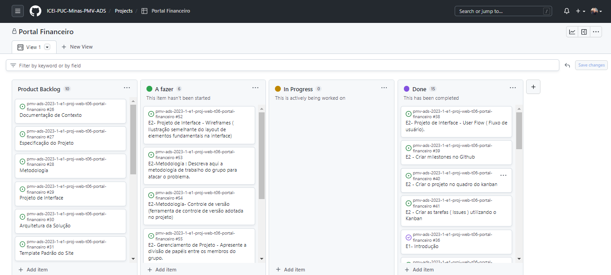
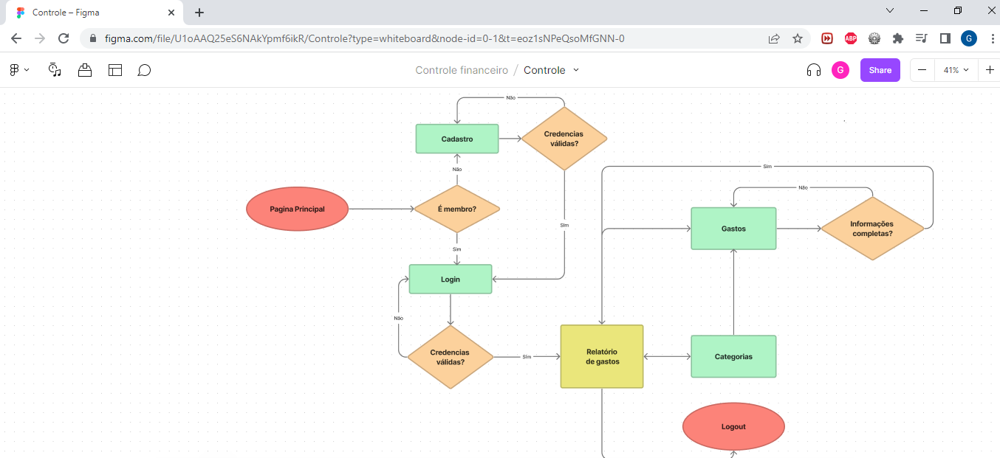
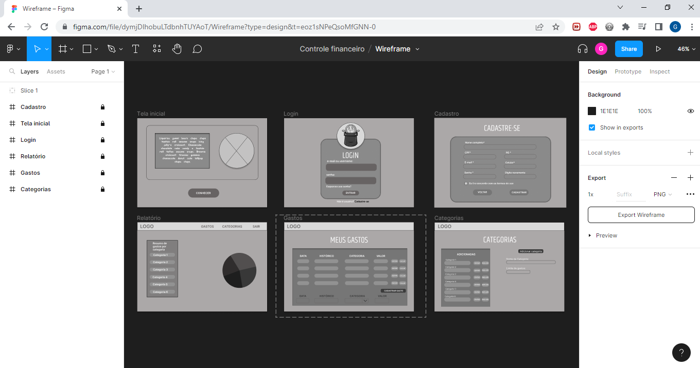
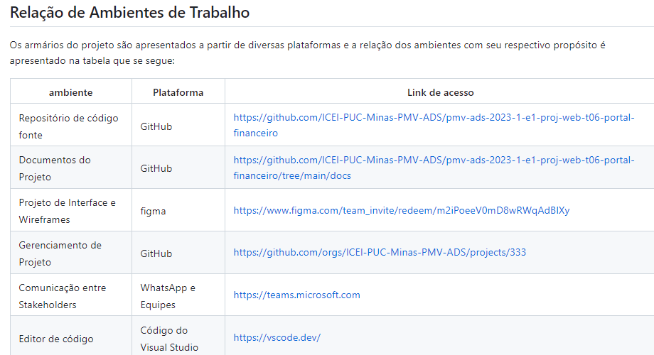
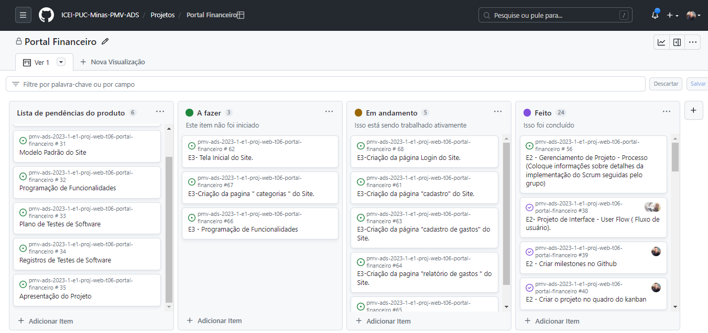
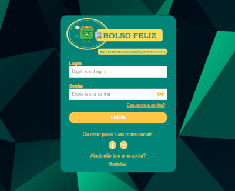
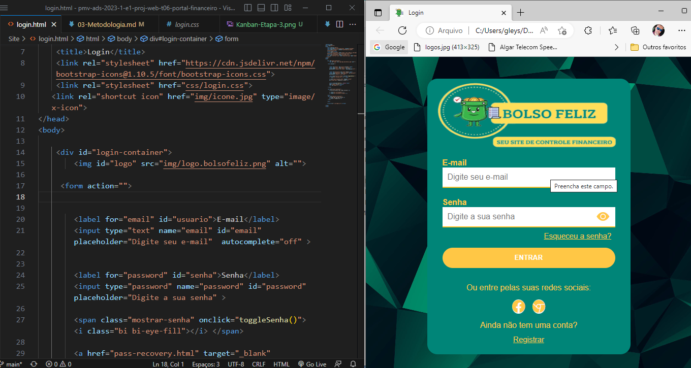
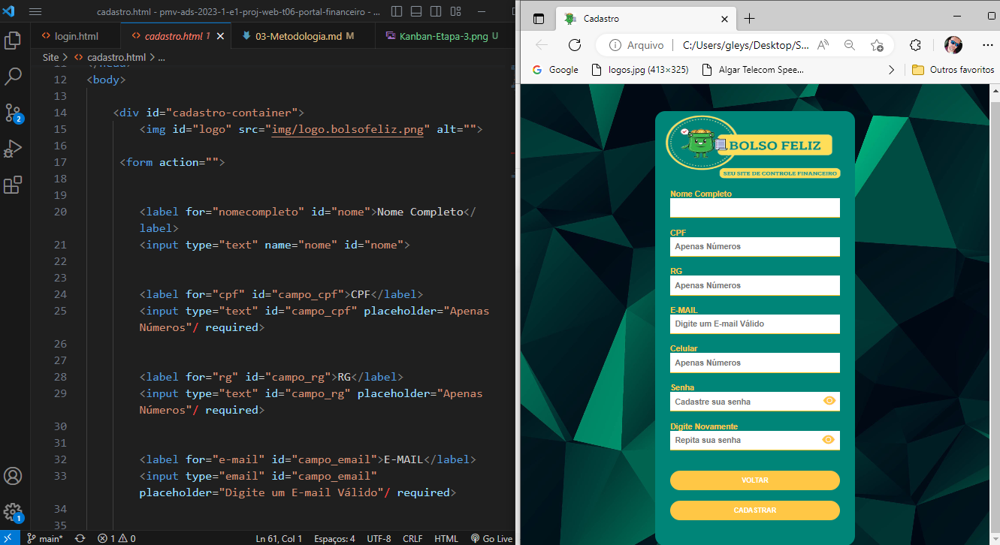
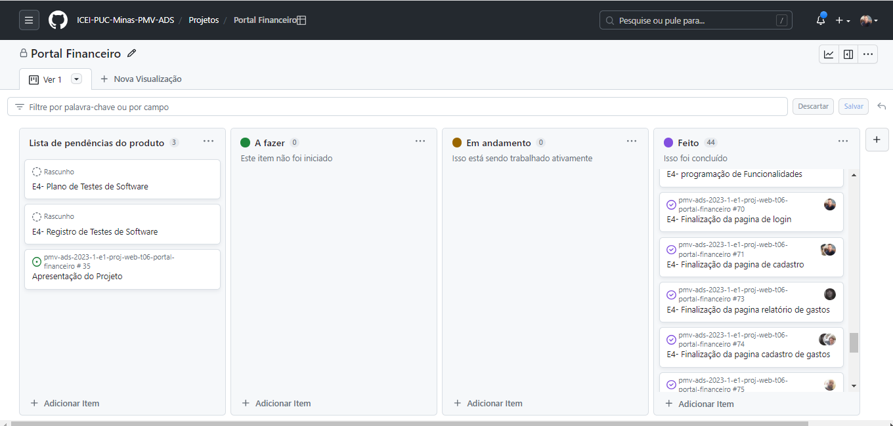

# Metodologia

Apresentamos a seguir a metodologia adotada pelo grupo para desenvolvedor o sistema de controle financeiro. Destacamos também as ferramentas e ambientes de trabalho utilizados pela equipe para o desenvolvimento do projeto. Isso inclui a descrição dos diferentes ambientes utilizados, bem como a estrutura para gerenciamento do código-fonte. Além disso, abordamos o processo e as ferramentas utilizadas para organizar e gerenciar o time.

 

## Relação de Ambientes de Trabalho

Os artefatos do projeto são desenvolvidos a partir de diversas plataformas e a relação dos ambientes com seu respectivo propósito é apresentada na tabela que se segue:

|Ambiente    | Plataforma  | Link de Acesso |
|-----------|---------------------|-------------------|
|Repositório de código fonte| GitHub |https://github.com/ICEI-PUC-Minas-PMV-ADS/pmv-ads-2023-1-e1-proj-web-t06-portal-financeiro  | 
|Documentos do Projeto| GitHub | https://github.com/ICEI-PUC-Minas-PMV-ADS/pmv-ads-2023-1-e1-proj-web-t06-portal-financeiro/tree/main/docs |
|Projeto de Interface e Wireframes| Figma | https://www.figma.com/team_invite/redeem/m2iPoeeV0mD8wRWqAdBlXy |
|Gerenciamento de Projeto| GitHub | https://github.com/orgs/ICEI-PUC-Minas-PMV-ADS/projects/333 |
|Comunicação entre Stakeholders | WhatsApp e Teams |  https://teams.microsoft.com  |
|Editor de código | Visual Studio Code| https://vscode.dev/ |
 

## Gerenciamento de Projeto

A equipe utiliza metodologias ágeis, tendo escolhido o Scrum como base para definição do processo de desenvolvimento.
A equipe está organizada da seguinte forma:

**Scrum Master:** Lucy Suxo

**Product Owner:** Gleyston Guimarães Silva

**Equipe de Desenvolvimento:** 
- André Fernandes Reis
- Fernando Anísio Goulart Pereira
- George Lucas Sales De Matos
- Gleyston Guimarães Silva
- Lucy Suxo
- Luiz Nader Arruda Junior

**Equipe de Design:**
- André Fernandes Reis
- Fernando Anísio Goulart Pereira
- George Lucas Sales De Matos
- Gleyston Guimarães Silva
- Lucy Suxo
- Luiz Nader Arruda Junior

### Processo

Para organização e distribuição das tarefas do projeto, a equipe está utilizando o quadro de tarefas do GitHub KANBAN estruturado com as seguintes listas:

**● Product Backlog:** 
|     |     |      |
|----------|-----------|--------------|
| E1- |Documentação de contexto|problema, objetivos, justificativa, trabalhos relacionados, público alvo|
| E1- |Especificação do projeto|personas, histórias de usuários, requisitos, restrições|
| E2- |Metodologia|ferramentas, gerenciamento de projeto|
| E2- |Projeto de interface|fluxo de usuários, wireframes|
| E3- |Template padrão do site|  |
| E3- |Programação de Funcionalidades|Tela X ou Funcionalidade X|
| E4- |Programação de Funcionalidades| |
| E4- |Plano de Testes de Software|Ferramentas de Testes (Opcional)|
| E4- |Registro de Testes de Software:|Avaliação|
| E5- |Apresentação| |
| E5- |Material de Apoio sobre a Apresentação de um Produto| Título do Projeto, Identidade Visual (Marca, Design), Conjunto de Slides (Estrutura)|

- Em andamento: Esta coluna recebe as tarefas que estão sendo desenvolvidas pelos integrantes do grupo.

- Revisar: Demonstra as tarefas que foram executadas, mas que devem ser avaliadas e discutidas pela equipe para determinar sua atualização.

- Feito: Esta coluna representa as tarefas que já foram executadas, avaliadas e dadas como feitas.

## Etapa 1

### Planejamento:

 Foram planejados dois documentos:
|Documentação de contexto:|  Especificação do Projeto:|
|-----------|---------------------|
|Introdução | Personas
Problema | História de usuários
Objetivos | Requisitos
Justificativa | Requisitos não funcionais
Trabalhos relacionados| Restrições
Público alvo | Juvenil

### Execução:

 Foram realizadas as tarefas da primeira etapa com reuiniões feitas no teams entre os integrantes do grupo e com o auxilio do professor Marcos Andre Silveira Kutova nas aulas-online feitas toda terça-feira as 19:00 horas.

### Evidências:

 Foram feitos os documentos : Documentação de contexto (Introdução, Problemas, Objetios, Justificativa, Trabalhos relacionados e Público alvo ) e, Especificação do Projeto (Personas, História de usuários, Requisitos, Requisitos não funcionais, Restrições ), com o acompanhamento do professor.
 

## Etapa 2

### Planejamento:

 Foram planejados dois documentos:
|Metodologia:| Projeto de interface:|
|-----------|---------------------|
|Relação de Ambientes de Trabalho|Fluxo do usuário|
|Gerenciamento de Projeto|Estruturas de arame|
|processo| |
|ferramentas| |

### Execução:

- Foram criadas as Issues e o Project adicionando suas tarefas a serem executas;

- Foram feitas as divisões de papeis do projeto escolhendo a função de cada integrante do grupo (product owner, scrum master, equipe de desenvolvimento e equipe de design);

- A criação do Fluxo de Usuários e WireFrames foram feitas com a colaboração dos integrantes do grupo em uma reunião utilizando a plataforma FIGMA.

- Designamos quais ferramentas serão utilizadas ao decorrer do projeto para sua execução com a possibilidade de adiconar mais ferramentas ou atualizá-las.

### Evidências:

 Foram feitos os documentos: Metodologia ( Relação de ambientes de trabalho, Gerenciamento de projeto, Processo ), Projeto de Interface ( Fluxo de usuário, Estrutura de arame), criando também o Project e as Issues no Kanban.  

 

 

 

 

## Etapa 3

### Planejamento:

Foram planejados dois documentos:

|Modelo padrão do Site:| Programação de Funcionalidades:| Metodologia |
|-----------|---------------------|------------|

### Execução: 

- Foram adicionadas novas Issues ao projeto para essa terceira etapa.

- Realizamos algumas reuniões entre os integrantes do grupo no Teams e entre conversas diárias pelo WhatsApp decidindo como seria o modelo padrão de nosso site, o ícone que iriamos utilizar e a logo de nossas páginas.

- Resolvemos entre os integrantes do grupo em dividir as páginas do site entre os membros e com essa divisão cada membro seria responsável por uma página. Sendo elas: (Login, Cadastro, Cadastro de Gastos, Gastos e Relatório de Gastos).

### Evidências:

 

 

 

## Etapa 4

### Planejamento:

Foram planejados três documentos:

Programação de Funcionalidades| Plano de Testes de Software | Registro de Testes de Software|
|-----------|---------------------|------------|
|-----------| Ferramentas de Testes |----------|

### Execução:

Foram executados a programação de funcionalidade, plano de teste de software e registro de testes de software, etapas cruciais para o sucesso do nosso projeto.

A programação de funcionalidade foi realizada com o objetivo de planejar e organizar o desenvolvimento das diferentes características ou funcionalidades do nosso site. Isso envolveu a definição clara dos requisitos e a divisão das tarefas em etapas gerenciáveis. Essa abordagem estruturada permitiu que a equipe de desenvolvimento trabalhasse de forma eficiente, garantindo que as metas do projeto fossem atingidas dentro do prazo estabelecido.

Em paralelo, o plano de teste de software foi elaborado, detalhando as estratégias e abordagens para verificar se o software desenvolvido atende aos requisitos e está livre de erros. Com esse planejamento cuidadoso, foi possível garantir que todas as funcionalidades fossem testadas antes da implantação, assegurando a qualidade geral do site. Durante a execução dos testes, foi realizado o registro de testes de software.

Durante a execução dos testes, foi realizado o registro de testes de software. Cada teste executado, juntamente com seus resultados, foi documentado para referência futura e análise. Esse registro incluiu informações detalhadas sobre os cenários de teste, os dados de entrada utilizados, as saídas esperadas e quaisquer observações relevantes. Essa abordagem sistemática do registro de testes de software permitiu uma visão abrangente do status dos testes realizados, identificando áreas que requeriam atenção adicional e facilitando a identificação e correção de possíveis falhas ou bugs no software.
 

### Evidências:
 

- kanban
 

 

- Milestone:
 

 

- Cenário de Teste: Página Inicial - Redirecionamento para a página de Login
 

  

 

- Cenário de Teste: Cadastro de Novo Usuário
 

  

 

- Cenário de Teste: Login de Usuário
 

  

 

- Cenário de Teste: Adicionar Categoria
 

  

 

- Cenário de Teste: Adicionar Gasto
 

  

 

**●Etapa 5**

**Planejamento:**

**Execução:**

**Evidências:**

### Ferramentas

Os componentes do nosso projeto são produzidos a partir de uma variedade de plataformas, cada uma com um propósito específico. Abaixo, apresentamos a relação entre os ambientes e suas respectivas funções no contexto do projeto.

* **Editor de código:** Visual Studio Code.
* **Ferramentas de comunicação:** Whatsapp, Teams.
* **Ferramentas de desenho de tela:** [Figma](https://www.figma.com/team_invite/redeem/m2iPoeeV0mD8wRWqAdBlXy)

O editor de código foi escolhido porque ele possui uma integração com o
sistema de versão. As ferramentas de comunicação utilizadas possuem
integração semelhante e por isso foram selecionadas. Por fim, para criar
diagramas utilizamos essa ferramenta por melhor captar as
necessidades da nossa solução.

Liste quais ferramentas foram empregadas no desenvolvimento do projeto, justificando a escolha delas, sempre que possível.
 
> **Possíveis Ferramentas que auxiliarão no gerenciamento**: 
> - [Slack](https://slack.com/)
> - [Github](https://github.com/)
